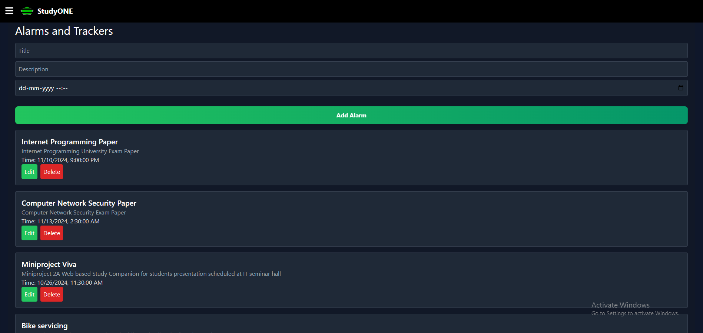

# StudyONE

## Overview

**StudyONE** is a robust, all-in-one study companion web application tailored to support students' academic and personal growth. Built to streamline organization, productivity, and collaboration, StudyONE equips students with tools like real-time collaborative boards, AI-powered lecture-to-notes conversion, a dedicated interview prep hub, and other advanced features.

## Features

1. **Industry-Standard Authentication**

   - Comprehensive authentication system including:
     - **Login**: Secure login for returning users.  
       
     - **Sign Up**: Allows new users to register and access the platform.  
       
     - **Forgot Password**: A reset feature to securely recover access.  
       
     - **Email Verification**: Ensures email verification to prevent unauthorized access.  
       
     - **Welcome and Password Reset Emails**: Automatically sent to users’ email addresses to confirm registration and assist with password recovery.  
         
       

2. **Bespoke Dashboard**

   - Customizable, user-specific dashboard offering seamless navigation.
   - Secure access and personalized experience.
   - Centralized control for managing all tools, updates, and insights.  
     

3. **Real-Time Collaborative Digital Board**

   - A space for students to brainstorm and collaborate, enabling live editing, drawing, and idea sharing in real-time.  
       
       
     

4. **Lecture to Notes (AI-Powered)**

   - AI-driven transcription service to convert lecture audio into organized text notes.
   - Integrates Rev.ai and Google Cloud Speech-to-Text APIs for accurate and accessible notes.  
       
     

5. **Interview Hub**

   - A dedicated hub for interview preparation.
   - Provides resources, Q&A, and peer support, helping students excel in job interviews and networking opportunities.  
     

6. **Alarms and Trackers**

   - Customizable alerts and reminders to keep students on track with deadlines and tasks.
   - Includes personal goal setting and progress tracking to enhance productivity.  
     
## Tech Stack

- **Frontend:** React, Tailwind CSS
- **Backend:** Node.js, Express
- **Database:** MongoDB
- **APIs:** Rev.ai, Google Cloud Speech-to-Text

## Access application on 
````bash
https://studyone.onrender.com
````
This application is hosted on free instance of render so it may take upto 50sec to load and once it has loaded then you will be able to use it without any delay.

## Installation on you local computer

1. Clone the repository:
   ````bash
   git clone https://github.com/KedarDamale/StudyONE.git
   ````
2. Create an .env file and add your own values:
   ````bash
   MONGO_URI=
   PORT=
   JWT_SECRET=
   NODE_ENV=
   SENDGRID_API_KEY=
   CLIENT_URL=
   GEMINI_API_KEY=
   REV_ACCESS_TOKEN=
   GEMINI_API_KEY_FOR_L2NOTES=
   ````
3. Setup server:
   ````bash
   npm install
   npm run dev
   ````
4. Setup client:
   ````bash
   cd frontend
   npm install
   npm run dev
   ````

## License

This project is licensed under the MIT License - see the [LICENSE](LICENSE) file for details.

## Contact

**Author**: Kedar Pravin Damale  
**Email**: [damalekedar@gmail.com](mailto:damalekedar@gmail.com)  
**GitHub**: [github.com/KedarDamale](https://github.com/KedarDamale)  
